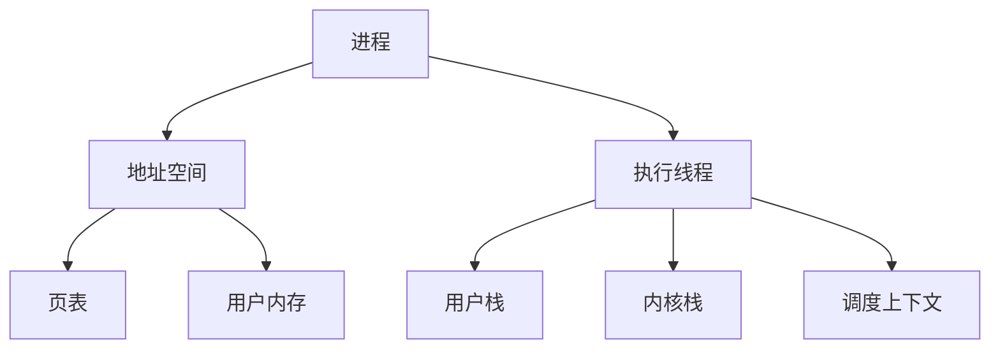
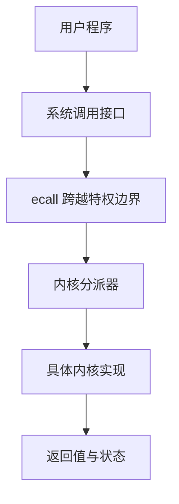
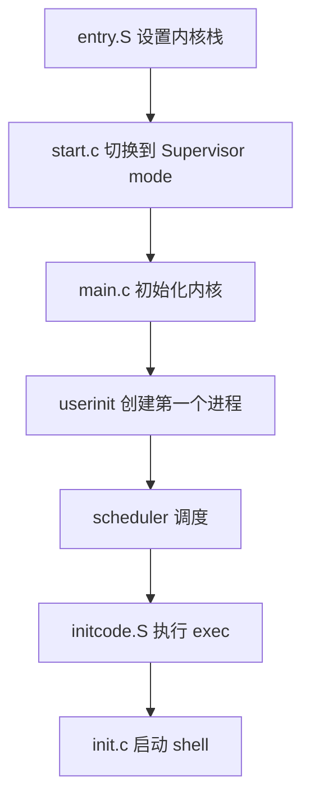
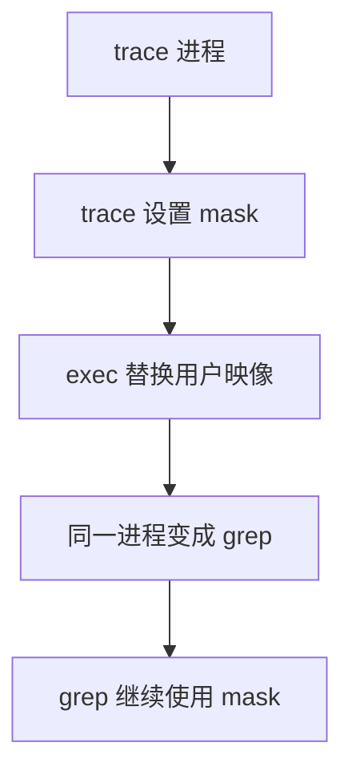
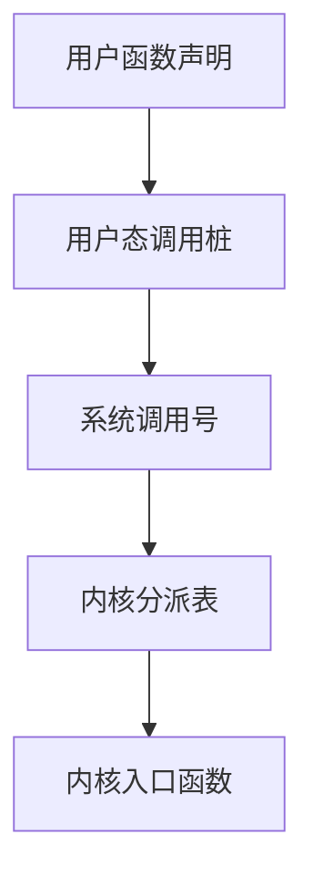
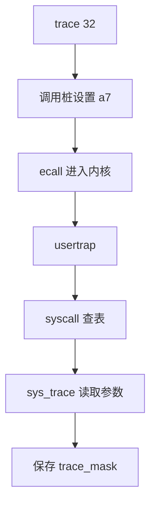
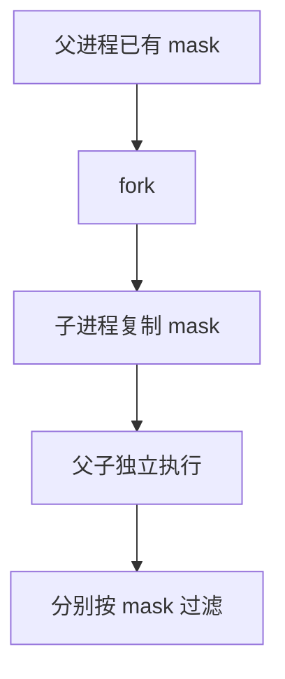
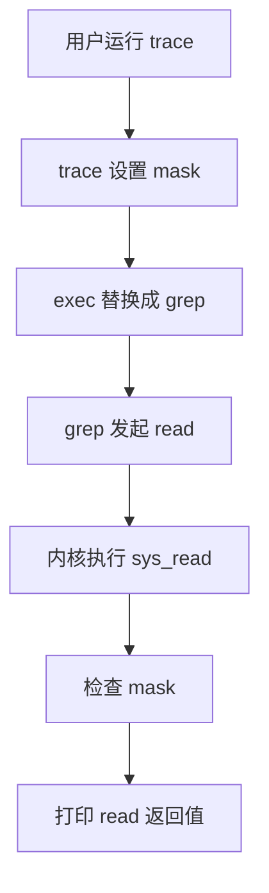
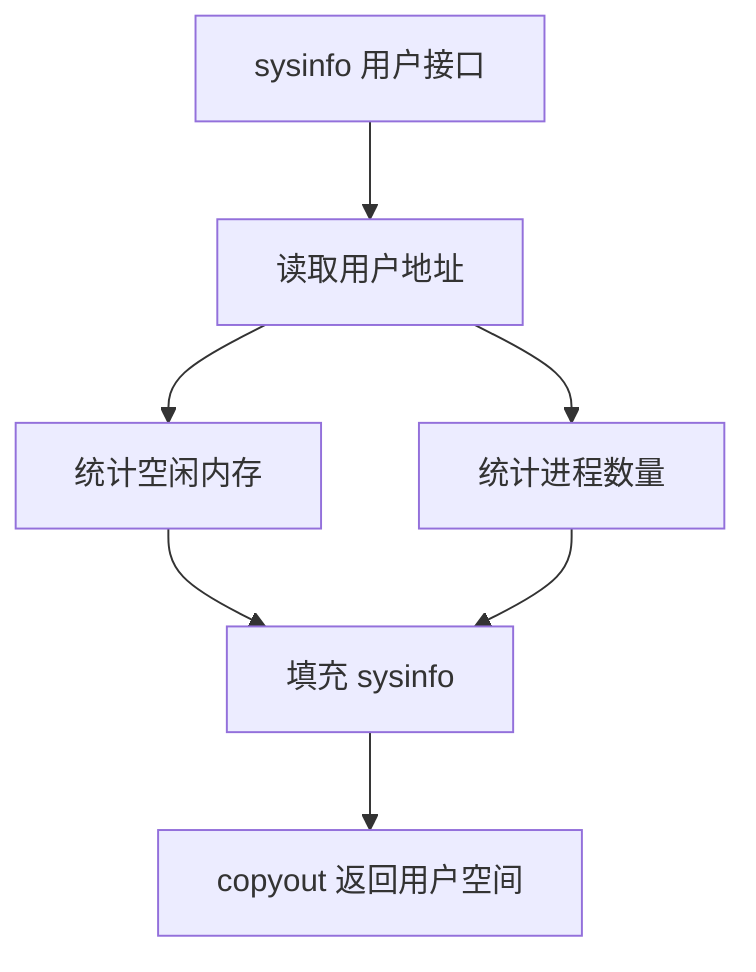

# [mit6.s081] Lab2: system calls 实验记录

这是实验过程中参考的一些相关资源:

- [课程主页](https://pdos.csail.mit.edu/6.828/2021/schedule.html)
- [课程视频翻译文档](https://mit-public-courses-cn-translatio.gitbook.io/mit6-s081)
- [xv6 book中文翻译](https://th0ar.gitbooks.io/xv6-chinese/content/content/chapter0.html)
- [操作系统导论](https://itanken.github.io/ostep-chinese/)
- [我的代码地址](https://ypj0.xyz/posts/blog-xv6-lab1/git@github.com:ypj0/xv6-labs-2021.git)

## Lab 2：system calls

操作系统需要同时满足三个要求：

- **多路复用**：多个进程共享 CPU、内存和设备；
- **隔离**：用户程序不能任意访问内核或其他进程；
- **交互**：进程可以通过文件描述符、管道和系统调用协作。

xv6 用进程作为主要的隔离单位。一个进程把地址空间和执行线程绑定在一起：



本实验增加的 `trace` 是进程的一项配置：该进程以及它通过 `fork()` 派生的子进程，哪些系统调用需要打印。

系统调用本身也是一种抽象：用户程序不能直接调用内核函数，而是按照约定发起受控请求。



## 启动背景

理解 `trace` 前，需要掌握 xv6 启动链路的几个节点：



### `kernel/proc.h`：进程状态的容器

`proc.h` 定义了进程、CPU 和寄存器现场。

```c
struct proc {
  struct spinlock lock;
  enum procstate state;
  int pid;

  uint64 kstack;
  uint64 sz;
  pagetable_t pagetable;
  struct trapframe *trapframe;
  struct context context;

  struct file *ofile[NOFILE];
  struct inode *cwd;
  char name[16];
};
```

几个字段要区分：

- `pagetable`：用户地址空间；
- `kstack`：进入内核后使用的栈；
- `trapframe`：用户态寄存器现场；
- `context`：内核线程在调度切换时保存的现场；
- `state`：`UNUSED`、`RUNNABLE`、`RUNNING` 等。

`trace_mask` 描述进程以后如何被跟踪，因此应该放进 `struct proc`，而不是放在某个函数的局部变量里。

### `kernel/defs.h`：模块接口

`defs.h` 只声明内核模块提供的函数，不负责实现。例如 `main.c` 通过它调用 `kinit()`、`kvminit()`、`userinit()` 和 `scheduler()`。真正的实现位于 `kalloc.c`、`vm.c`、`proc.c` 等文件中。

这体现了接口思维：调用者只依赖函数的名字、参数和返回值，不需要知道实现细节。

### `kernel/entry.S` 和 `kernel/main.c`

`entry.S` 是最早执行的汇编代码。它为每个 CPU 设置内核栈，然后调用 `start()`。`start()` 完成 Machine mode 下的早期配置，并通过 `mret` 进入 Supervisor mode 的 `main()`。

`main()` 负责初始化内存、页表、进程表、陷入处理、设备和文件系统，最后调用 `userinit()` 创建第一个用户进程，再进入 `scheduler()`。

### `user/initcode.S` 和 `user/init.c`

`initcode.S` 是第一个临时用户程序。它把 `SYS_exec` 放入 `a7`，把 `"/init"` 和参数地址放入 `a0/a1`，执行 `ecall`。

成功后，当前进程的用户映像被替换成 `/init`，也就是 `user/init.c` 编译出来的程序。`init.c` 打开控制台，设置文件描述符 0、1、2，然后 `fork()` 并 `exec("sh")` 启动 shell。

因此：

```text
initcode.S：把系统推进到 /init
init.c：启动控制台和 shell
```

## 实验目标：让内核跟踪系统调用

命令形式：

```bash
trace mask command [arguments ...]
```

示例：

```bash
trace 32 grep hello README
```

如果 `SYS_read == 5`，那么：

```text
1 << 5 = 32
```

`32` 表示跟踪 `read`。内核在每个系统调用返回前检查 mask，如果对应位被设置，就打印：

```text
pid: syscall name -> return_value
```

例如：

```text
3: syscall read -> 1023
```

这里的设计可以分成两部分：

```text
sys_trace()：设置进程的 trace_mask
syscall()：每次调用完成后，根据 trace_mask 决定是否打印
```

## 用户程序：`user/trace.c`

`trace` 命令本身不跟踪系统调用，它只做两件事：设置 mask，然后用 `exec()` 变成目标程序。

```c
int
main(int argc, char *argv[])
{
  int i;
  char *nargv[MAXARG];

  if(argc < 3 || (argv[1][0] < '0' || argv[1][0] > '9')){
    fprintf(2, "Usage: %s mask command\n", argv[0]);
    exit(1);
  }

  if(trace(atoi(argv[1])) < 0){
    fprintf(2, "%s: trace failed\n", argv[0]);
    exit(1);
  }

  for(i = 2; i < argc && i < MAXARG; i++)
    nargv[i-2] = argv[i];
  nargv[i-2] = 0;

  exec(nargv[0], nargv);
  exit(0);
}
```

对于：

```bash
trace 32 grep hello README
```

它会构造：

```text
nargv = { "grep", "hello", "README", 0 }
```

然后执行：

```c
trace(32);
exec("grep", nargv);
```

参数数组必须以 `0` 结尾，否则 `exec()` 不知道参数在哪里结束。

`exec()` 替换的是当前进程的用户代码、数据、栈和页表，不是整个 `struct proc`，所以 `pid`、父进程、打开的文件和 `trace_mask` 等进程属性仍然存在：



##  第一步：接通系统调用接口

新增系统调用时，用户和内核必须共同遵守一套协议：



### 用户接口

在 `user/user.h` 中加入：

```c
int trace(int);
```

这只是用户 C 程序看到的接口声明。

### 系统调用号

在 `kernel/syscall.h` 中加入：

```c
#define SYS_trace 22
```

这是用户态和内核态共同使用的编号。

### 调用桩

在 `user/usys.pl` 中加入：

```perl
entry("trace");
```

Makefile 会运行这个 Perl 脚本生成 `user/usys.S`，其中大致是：

```asm
trace:
    li a7, SYS_trace
    ecall
    ret
```

调用桩（stub）是用户态的一小段汇编桥梁，负责按 ABI 准备寄存器并执行 `ecall`。使用脚本生成，是因为每个系统调用桩结构几乎相同，脚本可以减少重复代码和编号错误。

### 把用户程序加入镜像

在 `Makefile` 的 `UPROGS` 中加入：

```make
$U/_trace\
```

否则 `trace` 不会被写入 xv6 的文件系统镜像，启动后也就找不到这个命令。

## `ecall`、寄存器和 trap

调用桩执行：

```asm
li a7, SYS_trace
ecall
```

两条指令的职责不同：

- `a7` 传递“要调用哪个系统调用”；
- `ecall` 触发 CPU 从 User mode 进入 Supervisor mode。

`ecall` 不会直接调用 `sys_trace()`。它只产生一个 trap，CPU 跳到内核设置的入口。`trampoline.S` 保存用户寄存器并切换到进程的内核栈，随后进入 `usertrap()`。

xv6 使用的寄存器约定是：

```text
a0-a5：系统调用参数
a7：系统调用号
a0：系统调用返回值
```

进入内核后，寄存器被保存到：

```c
p->trapframe->a0
p->trapframe->a1
...
p->trapframe->a7
```

`usertrap()` 看到 `scause == 8`，判断这是用户态执行 `ecall`，然后调用 `syscall()`。处理完成后，内核把返回值放回 `trapframe->a0`，通过 `sret` 回到用户态。

## `syscall()`：系统调用分派器

[kernel/syscall.c](../kernel/syscall.c) 中的 `syscalls[]` 是函数指针数组：

```c
static uint64 (*syscalls[])(void) = {
  [SYS_fork]  sys_fork,
  [SYS_exit]  sys_exit,
  [SYS_read]  sys_read,
  [SYS_exec]  sys_exec,
  [SYS_trace] sys_trace,
};
```

它把数字协议映射到内核函数：

```text
SYS_trace = 22
syscalls[22] = sys_trace
```

分派逻辑：

```c
num = p->trapframe->a7;

if(num > 0 && num < NELEM(syscalls) && syscalls[num])
  p->trapframe->a0 = syscalls[num]();
else
  p->trapframe->a0 = -1;
```

因此：

```c
syscalls[SYS_trace]();
```

等价于：

```c
sys_trace();
```

这就是系统调用“接口”和“实现”的连接点。

## `sys_trace()`：修改当前进程状态

在 `kernel/sysproc.c` 中：

```c
uint64
sys_trace(void)
{
  int mask;

  if(argint(0, &mask) < 0)
    return -1;

  myproc()->trace_mask = mask;
  return 0;
}
```

调用链是：



`argint(0, &mask)` 读取第 0 个系统调用参数。`sys_trace()` 的职责很小：读取参数、找到当前进程、保存配置、返回结果。它不负责打印后续调用。

## `trace_mask` 的生命周期

### 新进程：默认清零

进程表是固定数组，进程退出后槽位会变成 `UNUSED`，以后可能被新进程复用。因此 `allocproc()` 中要写：

```c
p->trace_mask = 0;
```

这防止新进程继承旧进程槽位中残留的 mask。

### `fork()`：复制有语义的状态

`fork()` 不会原样复制整个 `struct proc`。PID、内核栈、页表、锁和调度上下文都要重新建立；用户内存、寄存器和部分进程属性则按语义复制。

为了让跟踪对派生出的子进程继续有效：

```c
np->trace_mask = p->trace_mask;
```

父子进程可以执行不同的系统调用，但各自使用相同规则过滤自己的调用。



### `exec()`：替换程序，不替换进程

`exec()` 把当前进程的用户程序替换成另一个程序，但 PID、父进程关系、文件描述符和 `trace_mask` 仍属于当前进程。这正是 `trace` 命令先设置 mask、再 `exec()` 目标程序的原因。

## 在统一分派处打印跟踪结果

系统调用名称表：

```c
static char *syscall_names[] = {
  [SYS_read]  "read",
  [SYS_exec]  "exec",
  [SYS_trace] "trace",
};
```

在 `syscall()` 中，先调用真正的系统调用，再检查 mask：

```c
p->trapframe->a0 = syscalls[num]();

if((p->trace_mask & (1U << num)) != 0){
  printf("%d: syscall %s -> %d\n",
         p->pid,
         syscall_names[num],
         p->trapframe->a0);
}
```

顺序必须是：

```text
执行 sys_xxx()
    ↓
得到返回值
    ↓
检查 trace_mask
    ↓
打印名称和返回值
```

这样所有系统调用都经过统一逻辑，而不需要在每个 `sys_xxx()` 里重复写打印代码。

### 位运算中的括号

要写：

```c
if((p->trace_mask & (1U << num)) != 0)
```

不要写：

```c
if(p->trace_mask & (1U << num) != 0)
```

后者会被 C 解析成：

```c
p->trace_mask & ((1U << num) != 0)
```

不是在检查第 `num` 位；在 `-Werror` 下还会直接导致编译失败。

## 一次命令的完整流程

以：

```bash
trace 32 grep hello README
```

为例：



更细的 `trace(32)` 调用链是：

```text
trace.c: trace(32)
  → user/usys.S: a7 = SYS_trace; ecall
  → trampoline.S: 保存用户寄存器
  → usertrap(): 识别系统调用
  → syscall(): 读取 trapframe->a7
  → syscalls[SYS_trace]
  → sys_trace(): p->trace_mask = 32
  → trapframe->a0 = 0
  → usertrapret() → sret
```

之后 `exec("grep", ...)` 替换用户映像。`grep` 执行 `read()` 时，又重复同一条系统调用入口路径，只是这次 `a7 == SYS_read`，分派到 `sys_read()`，返回后根据 mask 打印。

##   `sysinfo`：读取系统整体状态

它和 `trace` 的区别在于：`trace` 修改当前进程状态，而 `sysinfo` 收集内核中的全局信息，再把一个结构体复制回用户空间。

### 需求如何映射到代码

题目要求 `sysinfo(struct sysinfo *)` 返回两个字段：

```c
struct sysinfo {
  uint64 freemem;  // 空闲内存字节数
  uint64 nproc;    // 状态不是 UNUSED 的进程数
};
```

把题目拆开后，代码位置就很明确：

| 需求 | 数据来源或实现位置 |
| --- | --- |
| 用户接口 | `user/user.h` |
| 调用桩 | `user/usys.pl` |
| 调用号和分派 | `kernel/syscall.h`、`kernel/syscall.c` |
| 返回结构体 | `kernel/sysproc.c` |
| 空闲内存 | `kernel/kalloc.c` |
| 进程数量 | `kernel/proc.c` |

完整关系是：



###  接通系统调用接口

和 `trace` 一样，先完成四个接口登记：

```c
// user/user.h
struct sysinfo;
int sysinfo(struct sysinfo *);
```

```perl
# user/usys.pl
entry("sysinfo");
```

```c
// kernel/syscall.h
#define SYS_sysinfo 23
```

```c
// kernel/syscall.c
extern uint64 sys_sysinfo(void);

[SYS_sysinfo] sys_sysinfo,
```

`SYS_sysinfo` 是数字，`sys_sysinfo` 是内核函数，`"sysinfo"` 是打印名称，三者不能混用。

### `sys_sysinfo()` 的职责

实现位于 `kernel/sysproc.c`：

```c
uint64
sys_sysinfo(void)
{
  uint64 addr;
  struct sysinfo info;
  struct proc *p = myproc();

  if(argaddr(0, &addr) < 0)
    return -1;

  info.freemem = freemem();
  info.nproc = nproc();

  if(copyout(p->pagetable, addr,
             (char *)&info, sizeof(info)) < 0)
    return -1;

  return 0;
}
```

它的职责只有四步：

```text
读取用户指针
  → 在内核中收集数据
  → copyout() 写回用户空间
  → 返回 0 或 -1
```

`argaddr()` 只取得用户传入的地址；它不负责保证目标地址可写。真正的用户地址检查由 `copyout()` 完成，因此非法地址测试会在 `copyout()` 失败时返回 `-1`。

这和 `sys_fstat()` 的模式相同：系统调用入口解析参数，内核函数构造结果，最后通过 `copyout()` 返回用户空间。

###  统计空闲内存：`freemem()`

`kernel/kalloc.c` 中的物理页分配器用 `kmem.freelist` 保存空闲页。每个 `struct run` 节点代表一个大小为 `PGSIZE` 的空闲页。

```c
uint64
freemem(void)
{
  uint64 bytes = 0;
  struct run *r;

  acquire(&kmem.lock);
  for(r = kmem.freelist; r; r = r->next)
    bytes += PGSIZE;
  release(&kmem.lock);

  return bytes;
}
```

这里必须注意：统计函数只能遍历链表，不能像 `kalloc()` 那样修改 `kmem.freelist`。因为统计过程和分配/释放可能并发发生，所以要持有 `kmem.lock`。

### 统计进程数量：`nproc()`

`kernel/proc.c` 中有固定大小的进程表：

```c
struct proc proc[NPROC];
```

题目要求统计所有状态不是 `UNUSED` 的槽位，因此 `USED`、`SLEEPING`、`RUNNABLE`、`RUNNING`、`ZOMBIE` 都要计入。

```c
uint64
nproc(void)
{
  uint64 count = 0;
  struct proc *p;

  for(p = proc; p < &proc[NPROC]; p++) {
    acquire(&p->lock);
    if(p->state != UNUSED)
      count++;
    release(&p->lock);
  }

  return count;
}
```

每个进程的 `state` 受对应的 `p->lock` 保护，因此读取前要加锁，读取后立即释放。各槽位是在不同时刻读取的，所以结果不保证对应全局同一瞬间；其他 CPU 仍可能在统计过程中创建或退出进程。

### 测试程序如何验证实现

`user/sysinfotest.c` 主要验证三类行为：

1. **非法地址**：把无效指针传给 `sysinfo()`，必须返回 `-1`；
2. **内存统计**：用 `sbrk(PGSIZE)` 分配和释放一页，`freemem` 应分别减少和恢复 `PGSIZE`；
3. **进程统计**：`fork()` 后进程数增加 1，子进程退出并 `wait()` 后恢复。

运行：

```bash
make clean
make
make qemu
```

进入 xv6 后：

```bash
sysinfotest
```

成功输出：

```text
sysinfotest: start
sysinfotest: OK
```

###  `trace` 和 `sysinfo` 的对比

| 特征 | `trace` | `sysinfo` |
| --- | --- | --- |
| 作用 | 修改当前进程的跟踪配置 | 查询系统整体状态 |
| 状态位置 | `struct proc.trace_mask` | `kmem.freelist`、`proc[]` |
| 返回方式 | 只返回整数状态码 | `copyout()` 返回结构体 |
| `fork()` 关系 | 子进程继承 mask | 统计结果包含子进程 |
| 主要锁 | 进程锁 | `kmem.lock` 和进程锁 |

这两个实验分别展示了两种常见系统调用：

```text
控制型系统调用：修改某个内核对象的状态
查询型系统调用：读取内核状态并复制给用户
```

## Lab 2 复习问答

下面的问题按「接口与陷入 → `trace` → `sysinfo` → 实现方法」排列。回答时先说职责，再说数据在哪里、如何跨越边界。

### 系统调用接口与执行路径

**1. 系统调用和内核函数是什么关系？**

系统调用是内核向用户程序提供的受控接口；用户态的 `sysinfo()` 是这个接口的调用入口。`sys_sysinfo()` 是内核中的处理函数，由 `syscall()` 根据调用号分派。内核函数不都属于系统调用，例如 `freemem()` 只在内核内部供其他函数调用。

**2. `sysinfo(&info)` 从用户态到内核态、再返回的路径是什么？**

`user/user.h` 声明接口；`user/usys.pl` 生成的调用桩把 `SYS_sysinfo` 放进 CPU 寄存器 `a7`，用户指针参数在 `a0`；`ecall` 触发 trap；`trampoline.S` 保存寄存器到 trapframe；`usertrap()` 识别系统调用；`syscall()` 从 `trapframe->a7` 取号并调用 `sys_sysinfo()`；处理函数经 `copyout()` 写入用户的 `info`，返回值写入 `trapframe->a0`；最后 `usertrapret()` 和 `sret` 回到用户态。注意：调用桩写的是 **CPU 的 `a7`**，trap 入口随后才将其保存为 `trapframe->a7`。

**3. 为什么用 `a7`、`a0` 和 `ecall`？**

这是 xv6 所遵循的 RISC-V 系统调用约定：`a7` 携带调用号，`a0` 起携带参数，`a0` 也接收返回值。`ecall` 触发从用户态进入内核的异常处理流程；它本身不按调用号直接执行某个 `sys_*` 函数，具体分派由 `syscall()` 完成。

**4. 什么是调用桩，为什么由 `usys.pl` 生成？**

调用桩是用户态的一小段汇编包装代码，负责设置调用号、执行 `ecall` 并返回。每个系统调用的包装代码结构相同，`usys.pl` 根据 `entry("名字")` 批量生成 `user/usys.S`，减少重复手写；真正的内核逻辑仍在 `sys_*` 等函数里。

**5. `trap`、`usertrap()`、`syscall()` 各负责什么？**

`trap` 是执行流因系统调用、中断或异常而转入内核的机制。`usertrap()` 是处理来自用户态 trap 的 C 入口，它根据原因选择处理方式；若原因是 `ecall`，再调用 `syscall()`。`syscall()` 只负责系统调用号的检查和分派，不处理所有类型的 trap。

**6. 增加一个系统调用，接口各处要接什么？**

在 `user/user.h` 声明用户函数，在 `user/usys.pl` 登记调用桩，在 `kernel/syscall.h` 分配唯一调用号，在 `kernel/syscall.c` 声明并登记 `sys_*` 处理函数，最后实现该函数。若要用 `trace` 打印名称，再给名称表增加同编号的字符串。`SYS_sysinfo` 是数字，`sys_sysinfo` 是函数，`"sysinfo"` 是名称，三者不可互换。

**7. `syscalls[]` 和 `syscall_names[]` 分别做什么？**

`syscalls[num]` 是函数指针，决定执行哪个内核处理函数；`syscall_names[num]` 是用于打印的字符串。两张表以相同调用号索引，但类型和用途不同。分派前还要检查编号范围以及对应函数指针是否存在。

**8. `sysinfo()` 的返回值和 `struct sysinfo` 分别怎么返回？**

`sys_sysinfo()` 返回的 `0` 或 `-1` 经 `trapframe->a0` 传回用户态，表示调用成功或失败；`freemem`、`nproc` 放在内核临时结构体中，通过 `copyout()` 写到用户指针指向的内存。一个寄存器返回状态，一个用户缓冲区承载结果。

### `trace`：进程状态与继承

**9. `sys_trace()` 只保存 mask，跟踪输出在哪里发生？**

`sys_trace()` 用 `argint()` 取得整数 mask，保存到当前进程的 `trace_mask`。以后每次系统调用经过 `syscall()`，分派器执行目标函数后检查该调用号对应的位；位为 1 才打印。mask 是过滤条件，不是一份将要执行的系统调用清单。

**10. 为什么 `trace_mask` 放在 `struct proc`，并在 `allocproc()` 初始化？**

mask 描述某个进程后续系统调用的跟踪配置，生命周期比一次 `sys_trace()` 调用长，所以放在进程对象中。`proc[]` 的槽位会在进程结束后重复使用；`allocproc()` 将 mask 置零，避免新进程继承旧槽位残留的配置。`allocproc()` 初始化本次分配所需的字段，但不表示进程的全部字段都由它统一复制。

**11. 为什么 `fork()` 要手动复制 mask？子进程调用不同的系统调用怎么办？**

`fork()` 创建新的 `struct proc`，按语义复制用户内存、寄存器、文件引用及选定的进程字段，不会把父进程的整个 `struct proc` 按字节复制。因此要显式执行 `np->trace_mask = p->trace_mask`。父子进程可以调用不同的系统调用；相同 mask 只表示它们使用相同的过滤规则。子进程以后也能单独调用 `trace()` 修改自己的 mask。

**12. 为什么 `trace(mask)` 后执行 `exec("grep", ...)`，mask 仍生效？**

`exec()` 在同一个进程中更换用户程序映像，包括用户代码、数据、栈和页表，不会整体替换 `struct proc`；PID、打开的文件及 `trace_mask` 等进程属性继续存在。因此新程序调用系统调用时仍受已有 mask 控制。

**13. `trace_mask` 用 `int` 还是 `uint32`？位判断要注意什么？**

当前接口 `trace(int)` 和 `argint()` 使用 `int`，进程字段用 `int` 可保持一致；若用 `uint32` 保存，赋值保留同样的 32 位位模式。判断时使用 `1U << num`，并加括号写成 `(mask & (1U << num)) != 0`。位移量必须小于类型宽度；本实验调用号在 32 位范围内。

### `sysinfo`：指针、统计与锁

**14. `trace` 和 `sysinfo` 的主要区别是什么？**

`trace` 改变当前进程的配置，返回一个状态码即可；`sysinfo` 读取内核中的全局状态，要将两个数写回用户提供的结构体。这决定了前者读取整数参数并修改 `proc`，后者读取指针参数、调用统计函数并使用 `copyout()`。

**15. `argaddr()` 和 `copyout()` 分别负责什么？为什么不能直接解引用用户指针？**

`argaddr(0, &addr)` 从参数寄存器取出用户传入的地址数值；在本版 xv6 中它直接返回 `0`，不验证地址。`copyout(p->pagetable, addr, ...)` 借助用户页表找到目标页，检查页表项有效且为用户页，然后将内核缓冲区的数据复制过去；失败返回 `-1`。内核不能把用户虚拟地址当作当前地址空间中的可信指针直接解引用。这里的 `copyout()` **没有单独检查 `PTE_W`**，不要把它描述成完整的写权限检查。

**16. 为什么 `sysinfo` 要先构造内核局部结构体，再 `copyout()`？**

统计函数得到的数据先保存在内核内存，随后统一通过用户内存访问接口传出。这样参数提取、数据收集和跨地址空间复制各有明确职责；`sys_fstat()` 调用 `filestat()` 的路径也采用相同模式。

**17. `freemem()` 为什么遍历 `kmem.freelist`，为什么持有 `kmem.lock`？**

空闲物理页由链表管理，一个节点代表一个 `PGSIZE` 大小的页；遍历节点并累加 `PGSIZE` 即为空闲字节数。`kalloc()`、`kfree()` 也会修改该链表，持锁可防止统计过程中链表变化。统计函数只读链表，即使持锁也不应把节点摘下或改动指针。

**18. `nproc()` 为什么只排除 `UNUSED`，为什么读取 `state` 要加 `p->lock`？**

题目定义进程数为所有状态不等于 `UNUSED` 的槽位数，因此 `USED`、`SLEEPING`、`RUNNABLE`、`RUNNING` 和 `ZOMBIE` 都计入。每个槽位的 `state` 由对应的 `p->lock` 保护，读取时应持锁，防止与状态更新并发。函数逐个锁定槽位，结果不保证是全局同一瞬间的原子快照。

**19. `sysinfo` 的两个字段是否来自同一瞬间？**

不保证。`freemem()` 与 `nproc()` 分别统计，`nproc()` 又逐个读取进程槽位；并发分配内存和创建进程可在两次读取之间发生。本实验要求的是正确使用各自的数据结构和锁，不要求跨两类资源获得原子快照。

**20. 如何验证 `sysinfo` 的错误路径和统计结果？**

非法用户地址应使 `copyout()` 失败，系统调用返回 `-1`；分配一页后空闲字节数应减少 `PGSIZE`，释放后恢复；`fork()` 后进程数应增加，子进程退出并被 `wait()` 回收后恢复。可运行 `sysinfotest`，预期输出 `sysinfotest: OK`。

### 从题目找到实现位置

**21. 面对新的系统调用题目，怎么决定该调用哪些函数？**

先把要求拆成三类：输入从哪里来、内核状态由谁管理、结果如何返回。整数输入找 `argint()`，用户地址找 `argaddr()`；空闲页到 `kalloc.c` 的 `kmem.freelist`，进程状态到 `proc.c` 的 `proc[]`；结构体输出参考 `sys_fstat()` / `filestat()` 的 `copyout()`。最后按用户声明、调用桩、编号、分派表、内核实现、用户程序和测试依次检查，能减少漏接某一层的错误。

**22. 编译和链接错误如何定位到系统调用的哪一层？**

用户程序提示函数未声明或找不到调用桩，检查 `user/user.h` 与 `user/usys.pl`；分派表把数字或字符串赋给函数指针时类型报错，检查 `SYS_*`、`sys_*` 和名称是否混用；链接报 `undefined reference to sys_sysinfo`，检查函数是否实现并编入内核；提示 `control reaches end of non-void function`，检查处理函数每条路径的返回值。编译通过后测试失败，再看参数读取、统计逻辑与 `copyout()`。
