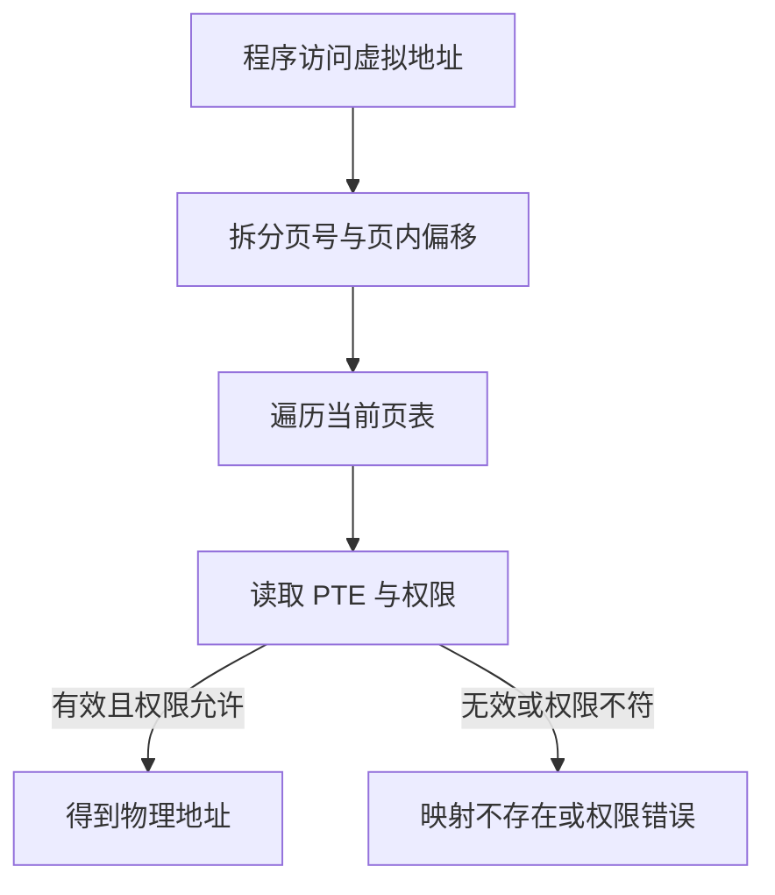
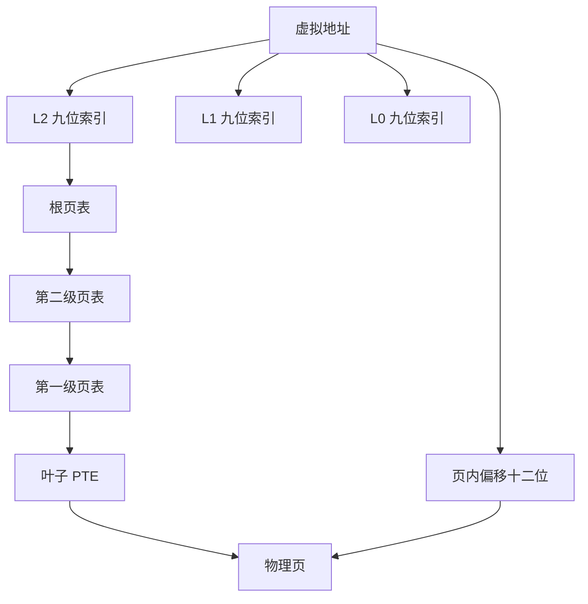
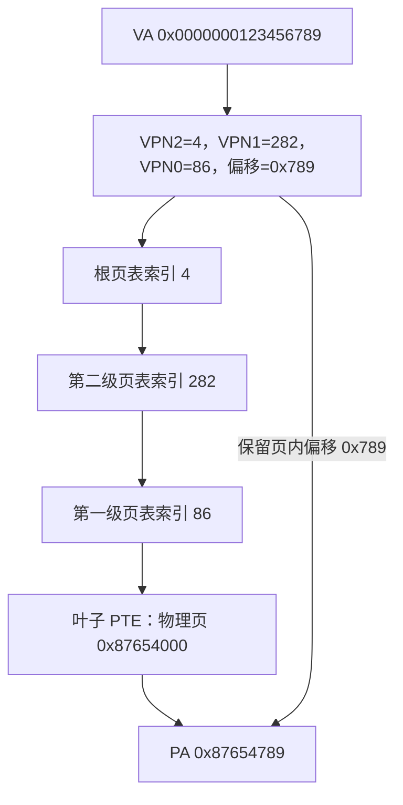
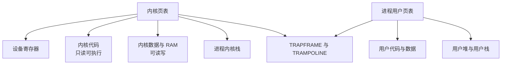
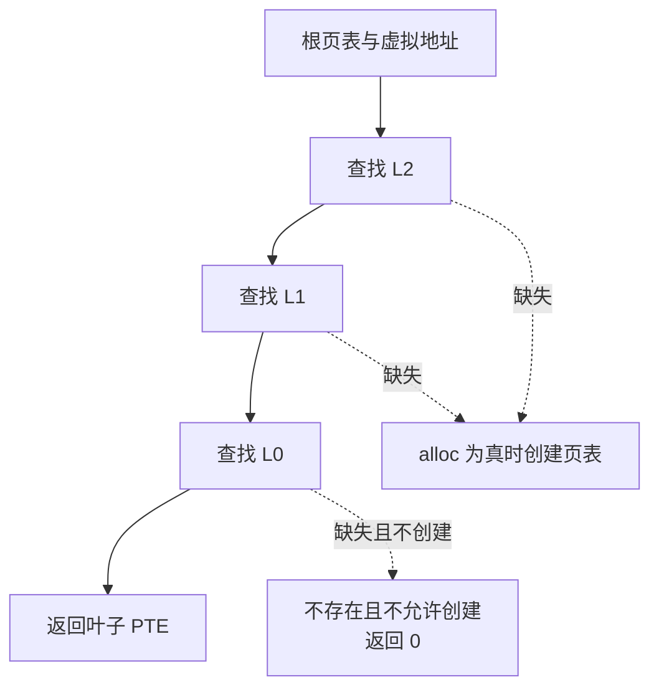
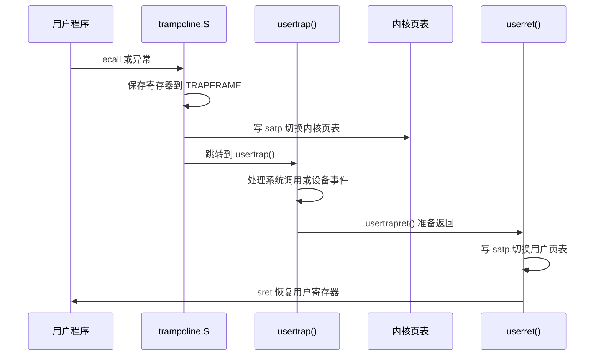
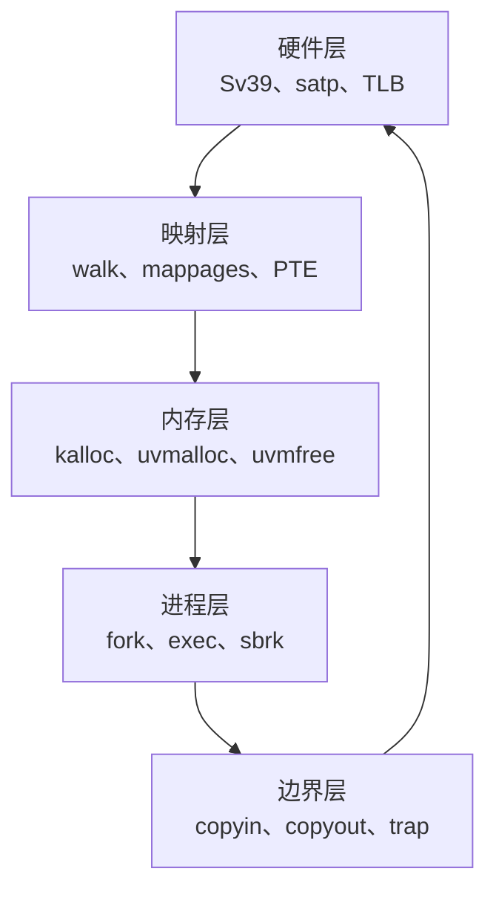
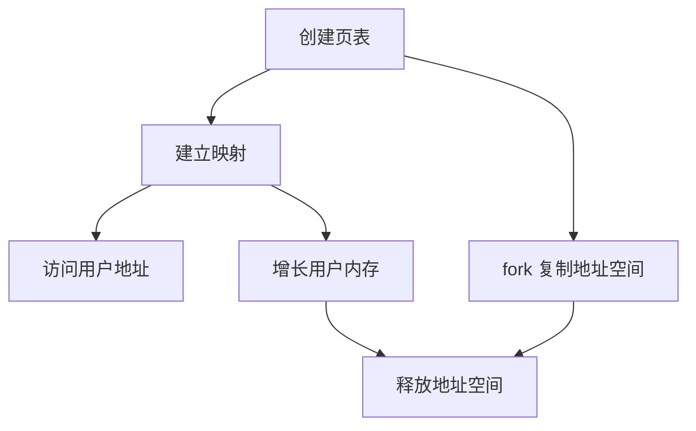

# Chapter 3：页表与虚拟内存

本文结合 xv6-riscv 源码讲解 xv6 手册 Chapter 3。核心主线是：程序使用虚拟地址，页表把虚拟页映射到物理页，硬件完成转换，内核负责创建、修改和销毁映射。

相关源码：

- kernel/vm.c：页表创建、映射、释放和用户内存复制；
- kernel/riscv.h：Sv39、PTE 标志位、地址转换宏；
- kernel/memlayout.h：物理内存和虚拟地址布局；
- kernel/proc.c：进程页表的创建、释放和 fork；
- kernel/exec.c：从 ELF 文件构造新的用户地址空间；
- kernel/trampoline.S、kernel/trap.c：用户页表与内核页表之间的切换。

## 1. 为什么需要页表

如果程序直接使用物理地址，一个进程就可能读写其他进程的内存，程序还必须知道物理内存的实际位置，内核、设备和用户程序也容易互相覆盖。

页表提供地址抽象和访问隔离：程序看到的是虚拟地址，处理器根据当前页表把虚拟地址转换成物理地址，同时根据 PTE 权限判断是否允许读、写和执行。



页表只转换页号，页内偏移保持不变。xv6 的页大小 PGSIZE 是 4096 字节，因此页内偏移占低 12 位。

## 2. RISC-V Sv39

xv6 使用 Sv39 三级页表。虚拟地址按下面方式拆分：

| 地址字段 | 位范围 | 含义 |
| --- | --- | --- |
| L2 索引 | 30--38 | 根页表索引 |
| L1 索引 | 21--29 | 第二级页表索引 |
| L0 索引 | 12--20 | 最后一级页表索引 |
| 页内偏移 | 0--11 | 页内字节位置 |

每一级页表有 512 个 64 位 PTE，因为 2^9 等于 512；一个页表页大小为 4096 字节，正好容纳 512 个 8 字节表项。



kernel/riscv.h 中的 PX(level, va) 宏根据级别取出对应的 9 位索引，PXSHIFT(level) 计算该字段的起始位。MAXVA 被定义为 1L << 38，以避开高位符号扩展带来的复杂性。


### 2.1 一个具体地址如何定位到 PTE

假设用户访问虚拟地址：

```text
VA = 0x0000000123456789
```

Sv39 将它拆成三级索引和页内偏移。页内偏移是低 12 位：

```text
offset = VA & 0xFFF
       = 0x789
```

三个页表索引可以按下面的公式计算：

```text
VPN[0] = (VA >> 12) & 0x1FF = 86
VPN[1] = (VA >> 21) & 0x1FF = 282
VPN[2] = (VA >> 30) & 0x1FF = 4
```

所以这个地址的完整拆分是：

```text
VPN[2] = 4
VPN[1] = 282
VPN[0] = 86
offset = 0x789
```

假设当前进程的根页表地址是 `root`，硬件会依次查找：

```text
root[4]
  → 得到第二级页表的物理地址

第二级页表[282]
  → 得到第一级页表的物理地址

第一级页表[86]
  → 得到最终叶子 PTE
```

假设最后的叶子 PTE 表示：

```text
物理页起始地址 = 0x87654000
权限 = PTE_V | PTE_R | PTE_W | PTE_U
```

那么虚拟页 `(4, 282, 86)` 映射到物理页 `0x87654000`。页内偏移不会改变，因此最终物理地址是：

```text
PA = 0x87654000 + 0x789
   = 0x87654789
```

整个过程可以概括为：



这里要区分两件事：**页表项的位置隐含虚拟页号，页表项内容保存物理页号和权限**。页表项不需要再次保存虚拟页号。

## 3. PTE：页表项

PTE 保存物理页号和访问权限：

| 标志 | 含义 |
| --- | --- |
| PTE_V | 映射有效 |
| PTE_R | 可读 |
| PTE_W | 可写 |
| PTE_X | 可执行 |
| PTE_U | 用户态可以访问 |

PA2PTE 把物理地址放入 PTE 的物理页号位置，PTE2PA 反向取出物理地址，PTE_FLAGS 取出标志位。

中间页表节点通常只有 PTE_V，表示它指向下一级页表；叶子 PTE 还带有 PTE_R、PTE_W 或 PTE_X，表示它直接映射物理页。freewalk() 正是利用这个区别递归释放页表。

## 4. satp、内核页表与用户页表

RISC-V 的 satp 寄存器保存地址转换模式和根页表的物理页号。xv6 使用 MAKE_SATP(pagetable) 生成 satp 值，写入后调用 sfence_vma() 清理旧的 TLB 转换缓存。

xv6 有两类页表：

| 页表 | 服务对象 | 典型内容 |
| --- | --- | --- |
| kernel_pagetable | 内核代码运行 | 设备寄存器、内核代码、内核数据、内核栈、trampoline |
| p->pagetable | 某个用户进程 | 用户代码、数据、堆、栈、trapframe、trampoline |

内核页表由 kvmmake() 建立，kvminithart() 写入每个 CPU 的 satp。用户进程返回用户态时，usertrapret() 把当前进程页表传给 trampoline.S，由汇编代码切换到用户页表并执行 sret。


### 4.1 每个进程到底有几张页表

需要区分“页表根”和“页表页”：

- 每个进程有一个用户页表根指针，即 p->pagetable；
- 这个根页表通过多级页表页连接到更多页表页，因此不是只有一个 4096 字节页表页；
- 每个 CPU 还有一个共享的 kernel_pagetable，内核代码运行时使用它；
- 进程在用户态使用自己的用户页表，陷入内核后切换到 kernel_pagetable。

因此“每个进程一个页表”是简化说法，更准确的是：

```text
每个进程一个独立的用户地址空间
  → 一个根页表
  → 连接若干中间页表页和叶子 PTE
  → 映射该进程的用户物理页
```

不同进程可以使用相同的虚拟地址，例如都访问虚拟地址 0，但它们的用户页表可以把这个地址映射到不同的物理页，所以彼此隔离。内核页表则由所有进程共享，但每个进程有自己的内核栈。

## 5. xv6 的地址空间布局

kernel/vm.c 中的 kvmmake() 建立内核直接映射。主要区域如下：

- KERNBASE：QEMU 中内核加载的物理基址；
- PHYSTOP：xv6 使用的物理 RAM 上限；
- TRAMPOLINE：虚拟地址空间最高处的跳板页；
- KSTACK(p)：第 p 个进程的内核栈，栈下方有无效 guard page。



用户虚拟地址从低地址开始依次放置代码、数据、用户栈和可增长的堆。地址空间顶部保留 TRAPFRAME 和 TRAMPOLINE。exec 创建的用户栈下面还有一个清除 PTE_U 的 guard page，用于捕获栈溢出。

## 6. walk：找到最后一级 PTE

walk(pagetable, va, alloc) 返回虚拟地址对应的最后一级 PTE 地址：

1. 使用 PX(level, va) 取当前级索引；
2. 如果当前 PTE 有效，用 PTE2PA 得到下一级页表地址；
3. 如果 PTE 无效且 alloc 为真，调用 kalloc() 分配下一级页表页并清零；
4. 到 L0 后返回叶子 PTE 地址。



walk 只负责找到 PTE，不分配用户数据页、不填写物理页号，也不负责用户权限检查。查找、建立映射和访问检查是三个不同职责。

## 7. mappages：建立映射

mappages(pagetable, va, size, pa, perm) 把一段虚拟地址映射到一段物理地址：

1. 对起止地址做页对齐；
2. 对每一页调用 walk(..., 1)，保证中间页表存在；
3. 写入 PA2PTE(pa) | perm | PTE_V；
4. 虚拟地址和物理地址都增加 PGSIZE。

mappages 只建立映射，不分配物理数据页。物理页由调用者先通过 kalloc() 获得，因此 uvmalloc() 是“分配物理页加建立映射”，kvmmap() 是“把已有物理地址映射进内核页表”。

## 8. walkaddr、copyin 与 copyout

walkaddr() 使用 walk(..., 0) 查找 PTE，并检查地址低于 MAXVA、PTE 有效以及 PTE_U。成功返回物理地址，失败返回 0。

copyin()、copyout() 和 copyinstr() 都以页为单位循环，正确处理跨页复制：

| 函数 | 方向 | 典型用途 |
| --- | --- | --- |
| copyin | 用户页表到内核缓冲区 | 读取用户数据 |
| copyout | 内核缓冲区到用户页表 | 返回结构体或结果 |
| copyinstr | 用户字符串到内核缓冲区 | 读取路径名 |

当前代码中的 walkaddr() 没有单独检查 PTE_W，因此 copyout() 并不是完整的写权限检查实现。读代码时应以实际代码为准。

## 9. 创建、增长和释放用户内存

### 9.1 创建空页表

uvmcreate() 只分配并清零根页表。proc_pagetable(p) 接着映射：

- TRAMPOLINE：指向 trampoline 汇编代码，权限为 PTE_R | PTE_X；
- TRAPFRAME：指向该进程的 trapframe，权限为 PTE_R | PTE_W。

这两个映射让用户 trap 进入和返回代码在页表切换期间仍然可用。

### 9.2 第一个用户程序

userinit() 创建第一个进程后，uvminit() 分配一个物理页，将 initcode 复制进去，并将虚拟地址 0 映射到该页。随后 initcode 通过 exec("/init") 换成真正的 init 程序。

### 9.3 uvmalloc 与 sbrk

growproc() 根据 sbrk(n) 的正负调用 uvmalloc() 或 uvmdealloc()。

uvmalloc() 对每个新页执行：

```text
kalloc 分配物理页
  → 清零物理页
  → mappages 建立用户映射
  → 返回新的进程大小
```

uvmdealloc() 调用 uvmunmap()，清除叶子 PTE，并在 do_free 为真时调用 kfree() 释放物理页。

### 9.4 uvmunmap、uvmfree 与 freewalk

uvmunmap() 删除叶子映射，要求虚拟地址页对齐，并拒绝把中间页表节点误当作叶子。

uvmfree() 必须先删除用户叶子映射并释放对应物理页，再调用 freewalk() 递归释放各级页表页。顺序不能反过来，因为页表是内核查找用户物理页的重要记录。

## 10. fork 与 exec 如何处理页表

### fork：创建独立地址空间

fork() 为子进程调用 allocproc() 创建空页表，再由 uvmcopy() 逐页复制父进程的物理内存和 PTE 权限。子进程拥有自己的物理页和页表，父子进程随后可以独立修改。

fork 不是按字节复制整个 struct proc。页表根、trapframe、内核栈、调度上下文和 PID 都必须重新建立；用户内存、寄存器和部分进程属性按语义复制。

### exec：在同一进程内替换用户映像

exec() 先创建新的页表，读取 ELF 的 program segment，分配用户页并通过 loadseg() 装载；然后创建用户栈和 guard page。所有步骤成功后，才把新页表、进程大小、入口地址和栈指针提交到当前进程，最后释放旧页表。

先构造新映像、最后提交，是为了加载失败时保留旧映像，使 exec 能返回 -1。exec 替换的是用户地址空间，不是整个进程对象。

## 11. 用户页表与 trap

RISC-V 硬件发生 trap 时不会自动切换页表，也不会自动切换到内核栈。xv6 因此把 trampoline.S 映射到用户页表和内核页表的同一虚拟地址。



跳板代码在切换页表前后都必须可执行；trapframe 在用户页表中有映射，才能在最初的 uservec 阶段保存寄存器；内核页表地址被写入 trapframe，供返回路径恢复。

## 12. 从题目找到实现位置

| 需求 | 主要函数 |
| --- | --- |
| 查虚拟地址对应的 PTE | walk() |
| 建立或删除映射 | mappages() / uvmunmap() |
| 分配或释放物理页 | kalloc() / kfree() |
| 检查用户地址并复制数据 | walkaddr() / copyin() / copyout() |
| 创建或销毁整个用户地址空间 | uvmcreate() / uvmfree() |
| 加载程序或调整内存大小 | exec() / uvmalloc() / uvmdealloc() |

不要把“分配物理内存”和“建立页表映射”当成同一件事：前者改变物理页分配器状态，后者改变地址转换关系。uvmalloc() 将两者组合，但 mappages() 本身不会分配数据页。

## 13. 常见问题

### 页表页和用户数据页有什么区别？

页表页存 PTE，描述映射关系；用户数据页存代码、变量和栈。两者都可能由 kalloc() 分配，但用途不同。freewalk() 释放页表页，uvmunmap(..., do_free=1) 释放叶子 PTE 指向的数据页。

### 为什么 copyout 不能直接写用户指针？

用户指针是当前进程地址空间中的虚拟地址。内核必须使用该进程页表验证映射、转换物理地址，并正确处理跨页和非法地址。

### 为什么 trampoline 要映射到两张页表？

trap 开始时仍使用用户页表，返回时又要切回用户页表；相同虚拟地址映射保证跳板在两个阶段都能继续执行。两张页表中的映射指向同一份物理代码。

### 为什么释放页表前要先释放叶子映射？

页表记录着哪些物理页属于该进程。先删除叶子映射并释放用户物理页，再释放页表页，才能完整回收地址空间。

### 页表切换后为什么需要 sfence.vma？

处理器可能缓存旧的虚拟地址转换。切换 satp 后执行 sfence.vma，确保后续访问不继续使用旧的 TLB 项。

## 14. 本章核心框架



记住这一条主线：

```text
进程使用虚拟地址
  → 当前 satp 指向根页表
  → walk 按 Sv39 三级索引找到 PTE
  → PTE 给出物理页和访问权限
  → 硬件完成地址转换
  → 内核通过 mappages、uvmunmap 和 copyout 管理边界
```

页表既是硬件进行地址转换的结构，也是 xv6 管理进程内存归属和权限的核心数据结构。


这份 `kernel/vm.c` 是 xv6 虚拟内存的核心文件。你目前学习 Chapter 3，重点不是逐行背代码，而是先建立下面两层框架：

```
第一层：页表本身如何查找、建立和删除映射
第二层：进程的用户地址空间如何创建、增长、复制和释放
```

***

# 一、先看整体调用关系



可以按这个顺序读：

```
kvmmake / uvmcreate
    → walk
    → mappages
    → walkaddr / copyin / copyout
    → uvmalloc / uvmdealloc
    → uvmcopy
    → uvmunmap / uvmfree / freewalk
```

***

# 二、内核页表：`kvmmake()`

## 1\. `kernel_pagetable`

```
pagetable_t kernel_pagetable;
```

这是内核使用的页表根地址。

内核启动时：

```
kvminit();
```

内部调用：

```
kernel_pagetable = kvmmake();
```

随后：

```
kvminithart();
```

把它写入 RISC-V 的 `satp`：

```
w_satp(MAKE_SATP(kernel_pagetable));
sfence_vma();
```

也就是说：

```
kvmmake()：创建内核页表
kvminithart()：让当前 CPU 开始使用内核页表
```

***

## 2\. `kvmmake()` 建立了哪些映射

```
kvmmap(kpgtbl, UART0, UART0, PGSIZE, PTE_R | PTE_W);
```

这是设备的直接映射：

```
虚拟地址 UART0 → 物理地址 UART0
```

同样：

```
kvmmap(kpgtbl, VIRTIO0, VIRTIO0, ...);
kvmmap(kpgtbl, PLIC, PLIC, ...);
```

然后映射内核代码：

```
kvmmap(kpgtbl,
       KERNBASE,
       KERNBASE,
       (uint64)etext - KERNBASE,
       PTE_R | PTE_X);
```

含义：

```
虚拟地址 KERNBASE
    → 物理地址 KERNBASE
```

权限是：

```
可读 + 可执行
```

没有 `PTE_W`，所以内核代码段不能被普通写入。

之后映射内核数据和可用物理内存：

```
kvmmap(kpgtbl,
       (uint64)etext,
       (uint64)etext,
       PHYSTOP - (uint64)etext,
       PTE_R | PTE_W);
```

权限是：

```
可读 + 可写
```

最后：

```
proc_mapstacks(kpgtbl);
```

把每个进程的内核栈映射到内核页表。

***

# 三、`walk()`：查找某个虚拟地址对应的 PTE

```
pte_t *
walk(pagetable_t pagetable, uint64 va, int alloc)
```

这是整个页表代码中最重要的函数之一。

它的职责是：

> 根据虚拟地址的三级索引，找到最后一级页表中的 PTE 地址。

它返回的是：

```
PTE 的地址
```

而不是：

```
物理地址
```

## 查找过程

```
for(int level = 2; level > 0; level--) {
  pte_t *pte = &pagetable[PX(level, va)];
```

假设虚拟地址被拆成：

```
VPN[2] = 4
VPN[1] = 282
VPN[0] = 86
```

那么查找过程就是：

```
根页表[4]
    ↓
第二级页表[282]
    ↓
第一级页表[86]
    ↓
得到最终 PTE
```

如果中间页表不存在：

```
if(!alloc || (pagetable = (pde_t*)kalloc()) == 0)
  return 0;
```

当：

```
alloc == 0
```

表示：

```
只查找，不创建
```

当：

```
alloc == 1
```

表示：

```
如果中间页表不存在，就分配一个新的页表页
```

因此：

```
walk(..., 0)：查找模式
walk(..., 1)：查找并按需创建页表
```

注意：`walk()` 不负责分配用户数据页，也不负责建立最终的物理页映射。

***

# 四、`mappages()`：建立虚拟页到物理页的映射

```
int
mappages(pagetable_t pagetable,
         uint64 va,
         uint64 size,
         uint64 pa,
         int perm)
```

它的职责是：

```
把虚拟地址范围 va
映射到物理地址范围 pa
```

核心代码：

```
*pte = PA2PTE(pa) | perm | PTE_V;
```

这表示：

```
PTE = 物理页号 + 权限位 + 有效位
```

注意：

> `mappages()` 只建立映射，不负责分配物理页。

例如：

```
char *mem = kalloc();
mappages(pagetable, va, PGSIZE,
         (uint64)mem,
         PTE_R | PTE_W | PTE_U);
```

这里：

```
kalloc()：分配物理页
mappages()：建立虚拟地址到该物理页的映射
```

这两个职责是分开的。

***

# 五、`walkaddr()`：把用户虚拟地址转换为物理地址

```
uint64
walkaddr(pagetable_t pagetable, uint64 va)
```

它的职责是：

```
用户虚拟地址 → 物理地址
```

它先调用：

```
pte = walk(pagetable, va, 0);
```

然后检查：

```
if((*pte & PTE_V) == 0)
  return 0;

if((*pte & PTE_U) == 0)
  return 0;
```

也就是说，这个地址必须：

1. 在地址范围内；
2. PTE 有效；
3. 允许用户访问。

最后：

```
pa = PTE2PA(*pte);
return pa;
```

注意它返回的是：

```
物理页起始地址
```

不是包含页内偏移的最终物理地址。

例如：

```
虚拟地址 = 0x123789
页内偏移 = 0x789
walkaddr() 返回物理页起始地址 0x87654000
```

真正访问的物理地址是：

```
0x87654000 + 0x789
```

`copyin()` 和 `copyout()` 会继续加上页内偏移。

***

# 六、`copyin()`、`copyout()`、`copyinstr()`

这三个函数解决的是：

> 内核如何安全地访问用户地址空间中的数据？

## 1\. `copyout()`

```
copyout(pagetable, dstva, src, len)
```

方向是：

```
内核缓冲区 → 用户空间
```

例如 `sysinfo()`：

```
copyout(p->pagetable,
        addr,
        (char *)&info,
        sizeof(info));
```

## 2\. `copyin()`

```
copyin(pagetable, dst, srcva, len)
```

方向是：

```
用户空间 → 内核缓冲区
```

内核读取用户传入的结构体或数据时使用。

## 3\. `copyinstr()`

```
copyinstr(pagetable, dst, srcva, max)
```

用于复制用户字符串，例如：

```
用户传入的路径名
```

它会一直复制，直到遇到 `'\0'`。

## 4\. 为什么要循环处理？

因为数据可能跨越两个页面：

```
第一页剩余 100 字节
第二页还有剩余数据
```

代码每次只复制当前页面中的部分：

```
n = PGSIZE - (dstva - va0);
```

当前页处理完后：

```
dstva = va0 + PGSIZE;
```

进入下一页。

这就是为什么不能简单地直接：

```
memmove(dst, (void *)srcva, len);
```

因为 `srcva` 是用户虚拟地址，不一定能被内核直接解引用，也可能跨页或指向非法地址。

***

# 七、用户地址空间的创建

## 1\. `uvmcreate()`

```
pagetable_t
uvmcreate()
```

它只做一件事：

```
分配并清零一个根页表页
```

```
pagetable = (pagetable_t) kalloc();
memset(pagetable, 0, PGSIZE);
```

此时还没有普通用户代码和数据映射。

***

## 2\. `proc_pagetable()`

它在 `proc.c` 中调用 `uvmcreate()` 后，加入两个特殊映射：

```
TRAMPOLINE
TRAPFRAME
```

因此，一个新进程的页表不是完全空的，它至少包含：

```
TRAMPOLINE 映射
TRAPFRAME 映射
```

***

## 3\. `uvminit()`

```
uvminit(pagetable, initcode, sz)
```

它为第一个用户进程建立初始代码：

```
分配物理页
  → 映射到虚拟地址 0
  → 把 initcode 复制到该物理页
```

```
mappages(pagetable,
         0,
         PGSIZE,
         (uint64)mem,
         PTE_W | PTE_R | PTE_X | PTE_U);
```

所以第一个用户程序最初从虚拟地址 `0` 开始执行。

***

# 八、`uvmalloc()`：增长用户内存

```
uvmalloc(pagetable, oldsz, newsz)
```

它被 `sbrk()` 使用，用于扩大进程的堆。

核心流程：

```
oldsz 到 newsz
  → 每次处理一页
  → kalloc() 分配物理页
  → memset() 清零
  → mappages() 建立用户映射
```

对应代码：

```
mem = kalloc();
memset(mem, 0, PGSIZE);

mappages(pagetable,
         a,
         PGSIZE,
         (uint64)mem,
         PTE_W | PTE_X | PTE_R | PTE_U);
```

这里四个权限表示：

```
PTE_R：可读
PTE_W：可写
PTE_X：可执行
PTE_U：用户可访问
```

xv6 的实现比较简单，代码和数据权限没有严格细分。

***

# 九、`uvmdealloc()` 和 `uvmunmap()`：释放用户内存

当进程执行：

```
sbrk(-n)
```

就需要释放一部分用户内存。

```
uvmdealloc(pagetable, oldsz, newsz)
```

如果确实缩小了地址空间，就调用：

```
uvmunmap(pagetable,
         PGROUNDUP(newsz),
         npages,
         1);
```

最后一个参数：

```
do_free = 1
```

表示：

```
删除映射的同时，释放物理页
```

`uvmunmap()` 中：

```
uint64 pa = PTE2PA(*pte);
kfree((void*)pa);
*pte = 0;
```

流程是：

```
找到 PTE
  → 取出物理页地址
  → kfree() 释放物理页
  → 清空 PTE
```

***

# 十、`freewalk()` 和 `uvmfree()`

## 1\. `freewalk()`

```
freewalk(pagetable)
```

递归释放页表页。

它要求：

```
所有叶子映射已经提前删除
```

如果发现一个带有：

```
PTE_R | PTE_W | PTE_X
```

的有效 PTE，说明它还是叶子映射：

```
panic("freewalk: leaf");
```

因此释放顺序必须是：

```
先释放用户物理页和叶子映射
再释放中间页表页
```

## 2\. `uvmfree()`

```
uvmfree(pagetable, sz)
```

负责释放整个用户地址空间：

```
uvmunmap()：释放用户物理页和叶子映射
freewalk()：递归释放页表页
```

这解释了为什么不能直接只调用 `freewalk()`。

***

# 十一、`uvmcopy()`：`fork()` 复制地址空间

`fork()` 创建子进程时使用：

```
uvmcopy(parent_pagetable,
        child_pagetable,
        sz);
```

它对父进程的每个用户页执行：

```
找到父进程 PTE
  → 取出父进程物理地址
  → kalloc() 给子进程分配新物理页
  → memmove() 复制内容
  → mappages() 映射到子进程页表
```

核心代码：

```
pa = PTE2PA(*pte);
flags = PTE_FLAGS(*pte);

mem = kalloc();
memmove(mem, (char*)pa, PGSIZE);

mappages(new, i, PGSIZE,
         (uint64)mem,
         flags);
```

注意：

> xv6 这里是物理页内容复制，不是父子进程共享同一物理页。

所以：

```
父进程虚拟页 → 父物理页
子进程虚拟页 → 子物理页
```

即使虚拟地址相同，物理页也不同。

***

# 十二、`uvmclear()`：创建 guard page

```
uvmclear(pagetable, va)
```

它不是删除映射，而是清除：

```
PTE_U
```

```
*pte &= ~PTE_U;
```

这意味着：

```
页仍然存在
内核可以访问
用户态不能访问
```

`exec()` 用它创建用户栈下面的 guard page。

***

# 十三、你目前最需要重点掌握的内容

建议分成三个层次学习。

## 第一优先级：必须真正理解

### 1\. 虚拟地址如何经过三级页表找到 PTE

必须能说清：

```
VA
  → VPN[2]
  → VPN[1]
  → VPN[0]
  → 叶子 PTE
  → 物理页号
  → 加页内偏移
  → 物理地址
```

### 2\. `walk()` 和 `mappages()` 的区别

```
walk()
    找 PTE

mappages()
    填写 PTE，建立映射
```

### 3\. 物理页分配和页表映射是两件事

```
kalloc()
    分配物理页

mappages()
    建立虚拟地址到物理页的关系
```

### 4\. `copyin()` / `copyout()` 的必要性

必须理解：

```
用户指针不是内核指针
```

内核要借助用户页表把用户虚拟地址转换到物理地址。

**内核态运行时用的是内核页表，用户虚拟地址在内核页表里没有映射，所以内核不能直接解引用用户指针。copyin/copyout 借助目标进程的用户页表，用 `walk` 手动把用户虚拟地址翻译成物理地址，再通过内核直接映射的物理内存完成数据拷贝。整个过程不切换页表，既避免了内核代码消失的问题，又能安全地访问用户内存。**

### 5\. `fork()`、`sbrk()`、`exec()` 与页表的关系

```
sbrk()
    增长或缩小用户地址空间

fork()
    复制用户页表和用户内存

exec()
    创建新的用户页表并替换旧用户映像
```

***

## 第二优先级：需要能够读懂

### 1\. `uvmunmap()`

理解：

```
删除叶子映射
可选地释放物理页
```

### 2\. `freewalk()`

理解：

```
递归释放页表页
不能残留叶子映射
```

### 3\. `TRAMPOLINE` 和 `TRAPFRAME`

理解它们为什么位于用户虚拟地址空间最高处，以及为什么需要映射到用户页表和内核页表。

### 4\. `satp` 和 `sfence.vma`

理解：

```
satp：指定当前根页表
sfence.vma：刷新旧的地址转换缓存
```

***

## 第三优先级：暂时可以先不深挖

这些内容可以先知道作用，之后再深入：

- PTE 的完整硬件格式；
- TLB 的具体实现；
- 超级页；
- 页表共享和写时复制；
- 页缺页异常；
- 地址空间随机化；
- 多核下的 TLB shootdown。

这些属于更完整的虚拟内存系统，xv6 当前实现没有全部覆盖。

***

# 十四、最后记住这条主线

```
用户程序产生虚拟地址
        ↓
当前 satp 指向进程页表根
        ↓
walk 按 VPN[2]、VPN[1]、VPN[0] 查找
        ↓
找到叶子 PTE
        ↓
PTE 提供物理页起始地址
        ↓
加上虚拟地址中的页内偏移
        ↓
得到最终物理地址
```

在代码层面：

```
kalloc()
    分配物理页

walk()
    找页表项

mappages()
    建立映射

walkaddr()
    虚拟地址转物理页地址

copyin/copyout()
    安全地跨用户/内核地址空间复制数据

uvmalloc()
    扩大用户内存

uvmcopy()
    fork 复制地址空间

uvmunmap/freewalk()
    删除映射并释放地址空间
```

---

